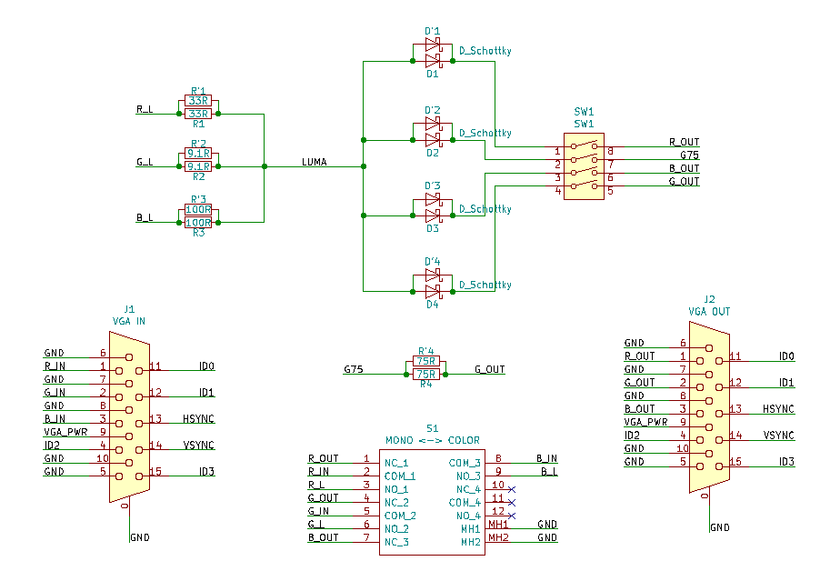
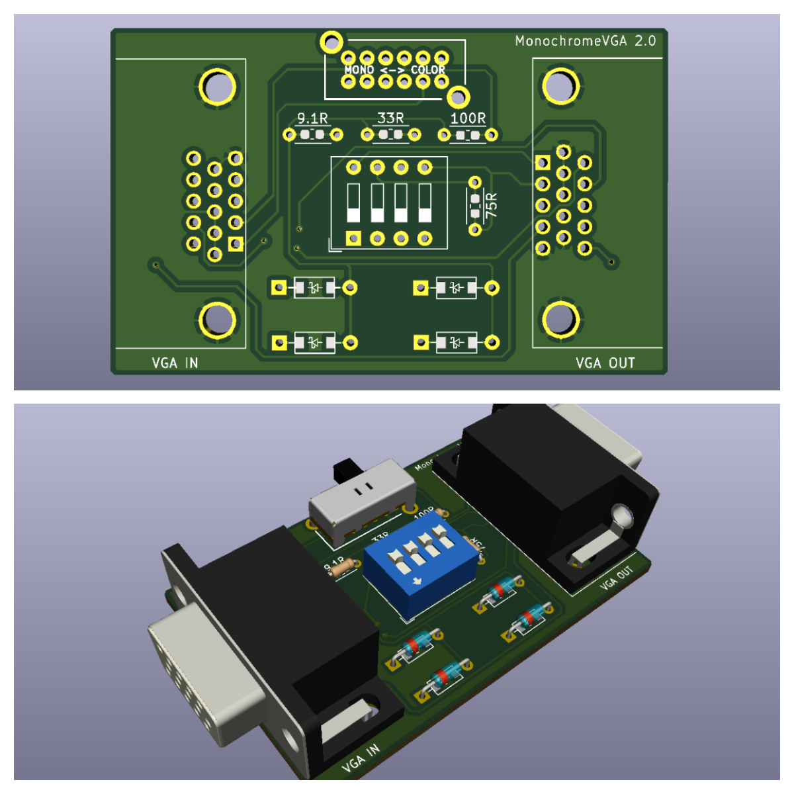
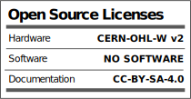

# Description

MonochromeVGA is a product to enjoy the charm of those monochrome monitors of the time but in the current video systems, and more specifically in your PC monitor. Although it could be connected to any TV, monitor or video system that has VGA inputs.

Select green, amber or B&W as monochromatic color, among others. Change color to monochrome or vice versa easily.

https://hackaday.io/project/166041-monochromevga

Disclaimer:

It is recommended to use MonochromeVGA inside an shielded container, which can be as simple as a cardboard box lined with aluminium foil, because although unlikely, the VGA signal could interfere with other nearby devices and depending on the laws of your country, it could lead to fines.

In any case, use any hardware posted here at your own risk.

